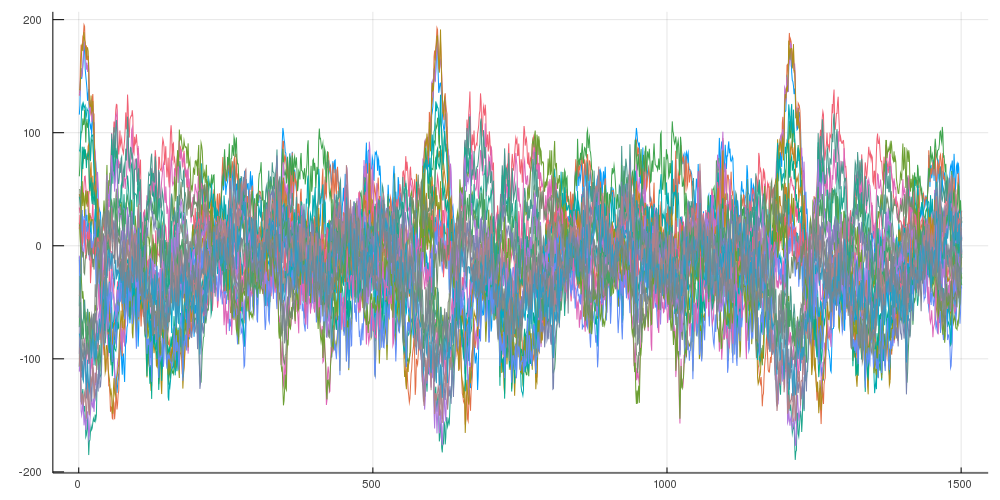
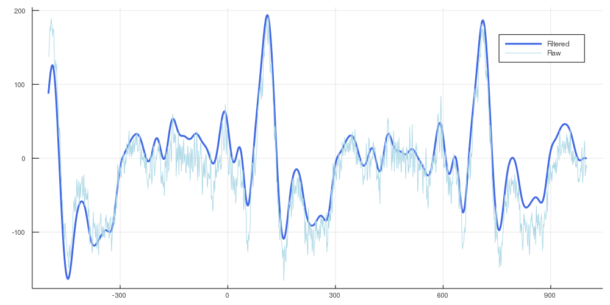
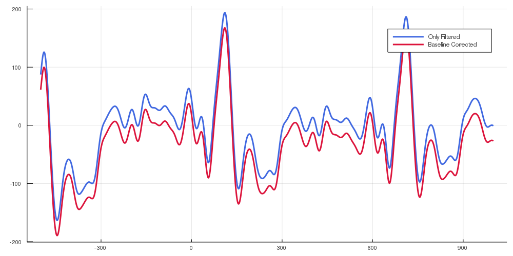
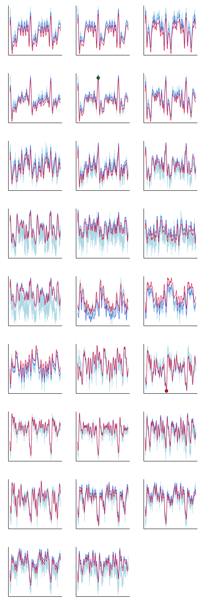
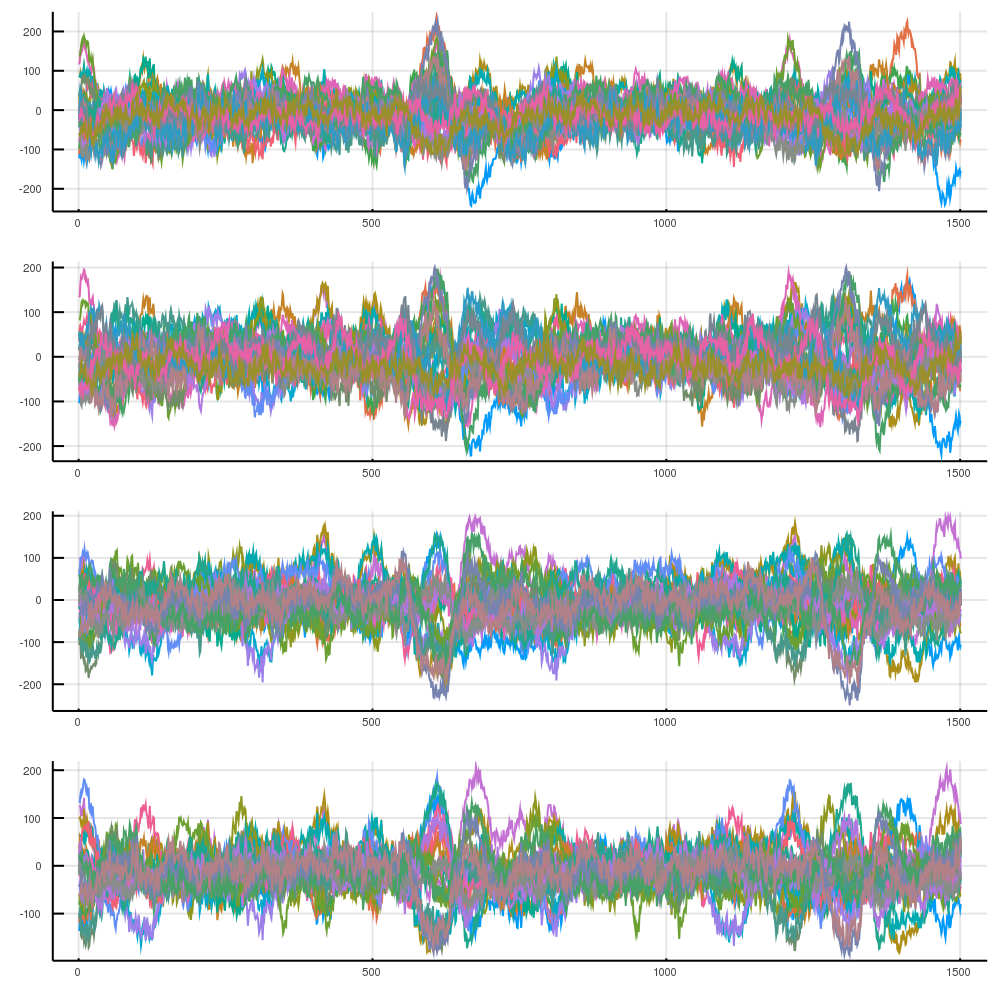
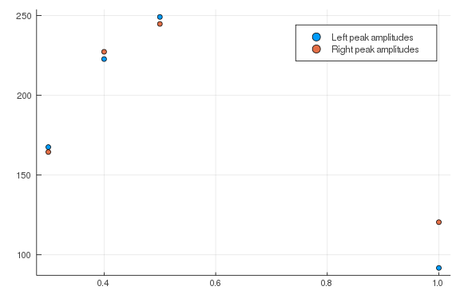

# Simple pipeline


Loading a single condition from subject where epoch data was extracted via BESA®. In This
example we use some more plausible data than the test data

````julia
using Plots
gr()
using Measures
using MegTools
test = load_cont_epochs("condEpoch.mat")
````


````
Dict{Any,Any} with 4 entries:
  "4" => [showing 3 of 100 slices]…
  "1" => [showing 3 of 100 slices]…
  "2" => [showing 3 of 100 slices]…
  "3" => [showing 3 of 100 slices]…
````


The data from condition "2" (defined in BESA®) is averaged across all the trials

````julia
test_average = average_across_trials(test["2"])
````


````
2-dimensional KeyedArray(NamedDimsArray(...)) with keys:
↓   time ∈ 1501-element Vector{Float64}
→   channels ∈ 319-element Vector{Symbol}
And data, 1501×319 Array{Float64,2}:
           (:MEG0112)  (:MEG0113)  …  (:IAS_Y)   (:IAS_z)   (:SYS201)
 (-500.0)   2.56249    21.5772        -0.655651  -0.417233   0.0     
 (-499.0)   3.12303    19.4094        -0.691414  -0.405312   0.0     
 (-498.0)   2.1424     13.8768        -0.679493  -0.321865   0.0     
 (-497.0)   1.7165     13.7295        -0.679493  -0.286102   0.0     
 (-496.0)   2.72797    15.3495     …  -0.715256  -0.309944   0.0     
 (-495.0)   1.81067    19.3068        -0.667572  -0.286102   0.0     
      ⋮                            ⋱                                 
  (994.0)   2.70243    -1.72295       -0.667572  -0.429153   0.0     
  (995.0)  -0.983829   -0.0452927     -0.691414  -0.38147    0.0     
  (996.0)  -4.31213     1.7537     …  -0.691414  -0.405312   0.0     
  (997.0)  -4.86396     3.63506       -0.64373   -0.405312   0.0     
  (998.0)  -3.68522     4.85062       -0.667572  -0.452995   0.0     
  (999.0)  -5.28816     5.96115       -0.619888  -0.405312   0.0     
 (1000.0)  -4.48724     4.85557       -0.64373   -0.429153   0.0
````


We select data that we're interested in: in this case the pre-defined auditoryN1m channels
and take a look at the averaged waveforms from the selected channels.

````julia
test_average_auditory,auditory_left,auditory_right = select_channels(
    test_average,
    paradigm="auditoryN1m",
)

plot(test_average_auditory, legend=false, size=(1000,500))
````





Applying filters to smoothen out the waveform

````julia
filtered = highlow_butterworth_filter(test_average_auditory, 1000)
plot(
    test["2"].time,
    filtered(channels=:MEG1621),
    label="Filtered", size=(1000,500),
    linewidth=3,
    color=:royalblue,
);
plot!(
    test["2"].time,
    test_average_auditory(channels=:MEG1621),
    label="Raw",
    color=:lightblue,
    )
````





Follow up with baseline correction of the data

````julia
baseline_corrected = baseline_correction(filtered)
plot(
  test["2"].time,
  filtered(channels=:MEG1621),
  label="Only Filtered",
  size=(1000,500),
  linewidth=3,
  color=:royalblue,
);
plot!(
    test["2"].time,
    baseline_corrected(channels=:MEG1621),
    label="Baseline Corrected",
    size=(1000,500),
    linewidth=3,
    color=:crimson,
  )
````





And finally finding peaks in both left and right sets of channels

````julia
a,_,b,_,c,d = find_peaks(baseline_corrected, auditory_left, auditory_right)

# Takinga look at all the channels with marked peak values
channel_plots = plot(layout=(9,3), size = (1000,3000), margin=5mm, legend=false, ticks=[])
for channel = 1:26
    plot!(
        channel_plots,
        test_average_auditory[:,channel],
        color=:lightblue,
        subplot=channel,
        label = "Raw Signal")
    plot!(
        channel_plots,
        filtered[:,channel],
        subplot=channel,
        width=2,
        color=:royalblue,
        label = "filtered Signal",
    )
    plot!(
        channel_plots,
        baseline_corrected[:,channel],
        subplot=channel,
        color=:crimson,
        width=2, label="Baseline corrected",
    )
    if test_average_auditory.channels[channel] == c
        plot!(
        reverse(findmax(baseline_corrected[:,channel])),
        seriestype=:scatter,
        subplot=channel,
        color=:green,
        label="Peak left hem", markersize=8,
    )
    elseif test_average_auditory.channels[channel] == d
        plot!(
            reverse(findmin(baseline_corrected[:,channel])),
            seriestype=:scatter,
            subplot=channel,
            color=:red,
            label="Peak right hem",
            markersize=8
        )
    end

end


channel_plots
````




#Pipeline with single subject (all conditions)

````julia
using Plots
gr()
using Measures
using MegTools
test = load_cont_epochs("condEpoch.mat")

test_average = average_across_trials(test)
````


````
Dict{Any,Any} with 4 entries:
  "4" => [-10.4638 -2.82368 … -0.345707 0.0; -10.8853 -4.47701 … -0.441074
0.0;…
  "1" => [-5.28188 -6.96084 … -0.345707 0.0; -3.12151 -9.73671 … -0.393391
0.0;…
  "2" => [2.56249 21.5772 … -0.417233 0.0; 3.12303 19.4094 … -0.405312 0.0;
 … ;…
  "3" => [-8.77625 -1.33373 … -0.357628 0.0; -6.94149 -3.89193 … -0.369549
0.0;…
````


Getting the averages of all conditions

````julia
test_average_auditory,auditory_left,auditory_right = select_channels(
    test_average,
    paradigm="auditoryN1m",
)

avs = plot(layout=(4,1), size=(1000,1000))
for (cond,val) in test_average_auditory
    plot!(avs, test_average_auditory[cond], legend=false)
end

avs
````





Filtering and baseline correcting

````julia
filtered = highlow_butterworth_filter(test_average_auditory, 1000)
baseline_corrected = baseline_correction(filtered)

peaks = find_peaks(baseline_corrected, auditory_left, auditory_right)
````


````
Dict{Any,Any} with 4 entries:
  "4" => Dict{Any,Any}("right_channel_label"=>:MEG2221,"left_peak_value"=>2
49.1…
  "1" => Dict{Any,Any}("right_channel_label"=>:MEG2611,"left_peak_value"=>9
1.75…
  "2" => Dict{Any,Any}("right_channel_label"=>:MEG2221,"left_peak_value"=>1
67.5…
  "3" => Dict{Any,Any}("right_channel_label"=>:MEG2221,"left_peak_value"=>2
22.7…
````


Loading trigger values from labels

````julia
cond_trigger_vals = load_trigger_values("regsoi")
````


````
Dict{String,Any} with 20 entries:
  "4"  => 0.5
  "1"  => 1.0
  "12" => 1.4
  "20" => "Noise"
  "2"  => 0.3
  "6"  => 0.7
  "11" => 1.3
  "13" => 1.5
  "5"  => 0.6
  "15" => 1.7
  "16" => 1.8
  "14" => 1.6
  "7"  => 0.8
  "8"  => 0.9
  "17" => 1.9
  "10" => 1.2
  "19" => 1.001
  "9"  => 1.1
  "18" => 2.0
  "3"  => 0.4
````


For this specific analysis I need the peaks from all averaged and preprocecced ERFS

````julia
soi, left_amps, right_amps = collect_peaks(peaks)
````


````
(Any[0.3, 0.4, 0.5, 1.0], Any[167.54163255378427, 222.76169962748236, 249.1
7313020699214, 91.75092170883264], Any[164.4568309644351, 227.3254603109246
3, 244.7908937654169, 120.45757339145912])
````


Plotting peaks that we got

````julia
scatter(soi,left_amps, label="Left peak amplitudes");
scatter!(soi,right_amps, label="Right peak amplitudes")
````



